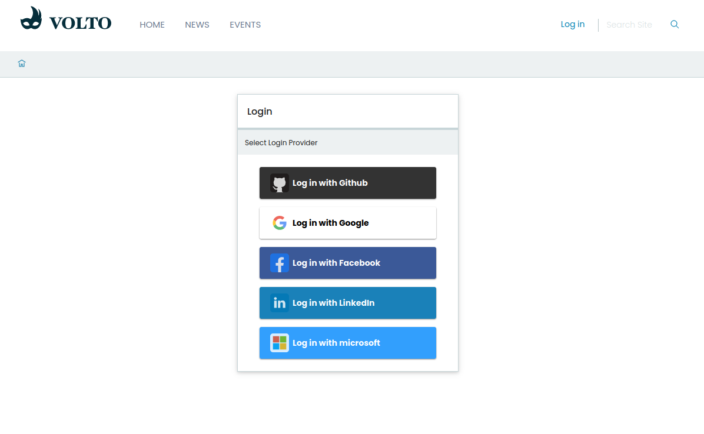

<div align="center"></div>

<h1 align="center">OAuth2 / OpenId Authentication in Volto (@plone-collective/volto-authomatic)</h1>

Addon implementing OAuth2 / OpenId Login in Volto sites.

This addon requires a server-side package to be installed. Currently we support one of the following:

* [pas.plugins.authomatic](https://github.com/collective/pas.plugins.authomatic/) version 2.0.0b2 or superior
* [pas.plugins.oidc](https://github.com/collective/pas.plugins.oidc/) version 2.0.0a1 or superior


<div align="center">

Social Login with OAuth2/OpenId for Volto sites.

[](https://www.npmjs.com/package/@plone-collective/volto-authomatic)
[](https://collective.github.io/volto-authomatic/)
[](https://github.com/collective/volto-authomatic/actions/workflows/main.yml)

[](https://github.com/collective/volto-authomatic)
[](https://github.com/collective/volto-authomatic)

</div>

## Features

### Screenshots

### Login Form



## Examples

volto-authomatic can be seen in action at the following sites:

- [Plone](https://plone.org)
- [Plone Brasil](https://plone.org.br)
- [2024 Plone Conference](https://2024.ploneconf.org)
- [2023 Plone Conference](https://2023.ploneconf.org)
- [2022 Plone Conference](https://2022.ploneconf.org)
- [2021 Plone Conference](https://2021.ploneconf.org)

## Installation

To install your project, you must choose the method appropriate to your version of Volto.


### Volto 18 and later

Add `@plone-collective/volto-authomatic` to your `package.json`:

```json
"dependencies": {
    "@plone-collective/volto-authomatic": "*"
}
```

Add `@plone-collective/volto-authomatic` to your `volto.config.js`:

```javascript
const addons = ['@plone-collective/volto-authomatic'];
```

## Test installation

Visit http://localhost:3000/ in a browser, login, and check the awesome new features.


## Configuration

### Display Plone Authentication
When using this package alongside `pas.plugins.authomatic` on the backend, you can optionally enable Plone’s native login as one of the available authentication providers.

To do this, set `config.settings.showPloneLogin` to `true` in your project configuration. By default, this option is set to `false`.

#### For JavaScript projects

Edit your project's `index.js` and update the `applyConfig` function:

```javascript
const applyConfig = (config) => {
  config.settings.showPloneLogin = true;
  return config;
};

export default applyConfig;
```

#### For TypeScript projects

The setup is similar, but you’ll also need to extend the type definition to your `index.ts`:

```typescript
import type { ConfigType } from '@plone/registry';

declare module '@plone/types' {
  export interface SettingsConfig {
    showPloneLogin: boolean;
  }
}

export function applyConfig(config: ConfigType) {
  config.settings.showPloneLogin = true;
  return config;
}

export default applyConfig;
```

## Development

The development of this add-on is done in isolation using a new approach using pnpm workspaces and latest `mrs-developer` and other Volto core improvements.
For this reason, it only works with pnpm and Volto 18 (currently in alpha).


### Prerequisites ✅

-   An [operating system](https://6.docs.plone.org/install/create-project-cookieplone.html#prerequisites-for-installation) that runs all the requirements mentioned.
-   [nvm](https://6.docs.plone.org/install/create-project-cookieplone.html#nvm)
-   [Node.js and pnpm](https://6.docs.plone.org/install/create-project.html#node-js) 22
-   [Make](https://6.docs.plone.org/install/create-project-cookieplone.html#make)
-   [Git](https://6.docs.plone.org/install/create-project-cookieplone.html#git)
-   [Docker](https://docs.docker.com/get-started/get-docker/) (optional)

### Installation 🔧

1.  Clone this repository, then change your working directory.

    ```shell
    git clone git@github.com:collective/volto-authomatic.git
    cd volto-authomatic
    ```

2.  Install this code base.

    ```shell
    make install
    ```


### Make convenience commands

Run `make help` to list the available commands.

```text
help                             Show this help
install                          Installs the add-on in a development environment
start                            Starts Volto, allowing reloading of the add-on during development
build                            Build a production bundle for distribution of the project with the add-on
i18n                             Sync i18n
ci-i18n                          Check if i18n is not synced
format                           Format codebase
lint                             Lint, or catch and remove problems, in code base
release                          Release the add-on on npmjs.org
release-dry-run                  Dry-run the release of the add-on on npmjs.org
test                             Run unit tests
ci-test                          Run unit tests in CI
backend-docker-start             Starts a Docker-based backend for development
storybook-start                  Start Storybook server on port 6006
storybook-build                  Build Storybook
acceptance-frontend-dev-start    Start acceptance frontend in development mode
acceptance-frontend-prod-start   Start acceptance frontend in production mode
acceptance-backend-start         Start backend acceptance server
ci-acceptance-backend-start      Start backend acceptance server in headless mode for CI
acceptance-test                  Start Cypress in interactive mode
ci-acceptance-test               Run cypress tests in headless mode for CI
```

### Development environment set up

Install package requirements.

```shell
make install
```

### Start developing

Start the backend.

```shell
make backend-docker-start
```

In a separate terminal session, start the frontend.

```shell
make start
```

### Lint code

Run ESlint, Prettier, and Stylelint in analyze mode.

```shell
make lint
```

### Format code

Run ESlint, Prettier, and Stylelint in fix mode.

```shell
make format
```

### i18n

Extract the i18n messages to locales.

```shell
make i18n
```

### Unit tests

Run unit tests.

```shell
make test
```

### Run Cypress tests

Run each of these steps in separate terminal sessions.

In the first session, start the frontend in development mode.

```shell
make acceptance-frontend-dev-start
```

In the second session, start the backend acceptance server.

```shell
make acceptance-backend-start
```

In the third session, start the Cypress interactive test runner.

```shell
make acceptance-test
```

## License

The project is licensed under the MIT license.

## Credits and Acknowledgements 🙏

Generated using [Cookieplone (0.9.7)](https://github.com/plone/cookieplone) and [cookieplone-templates (0d65af5)](https://github.com/plone/cookieplone-templates/commit/0d65af55872b6c53ea0208a672e0da73dcf2173b) on 2025-04-29 21:39:34.945036. A special thanks to all contributors and supporters!
